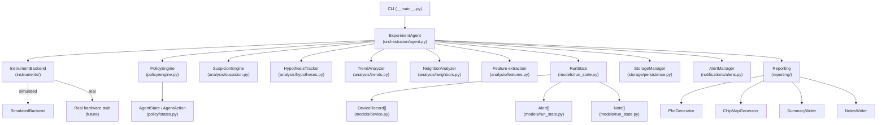

IV-Agent Autonomous cap Breakdown reliability characterization (AI PhD student)

An agentic experiment manager for capacitor I–V breakdown durability measurements.

This is not just a scripted measurement loop! The IV agent makes PhD-student-like decisions during a run. It adapts its measurement plan based on what it observes, reasons about causes, detects spatial and temporal trends, and sends you an email when something goes wrong. Once it's done measuring, it send you a summary with notes with the observations.

---

## What it does

IV-Agent orchestrates reliability characterisation of a 2D grid of on-chip capacitor devices (MIM, MOS, or similar dielectrics). The agent:

1. Steps through every device in the grid
2. Runs an initial I–V health-check measurement
3. *Decides* whether the device is healthy, shorted, degrading, or has a contact issue
4. If healthy — begins repeated stress / durability sweeps
5. After each batch — analyses the temporal trend and decides whether to continue, switch protocol, or stop
6. Continuously compares each device to its neighbours and flags spatial anomalies
7. Maintains a *suspicion score* that triggers extra actions (retries, control checks, escalations)
8. Tracks structured *hypotheses* about what is happening and updates them with evidence.
9. Writes self-generated *experiment notes* in plain language
10. Sends *severity-graded alerts* and optionally pauses the run when human intervention is needed

Agentic/AI capabilities are *highlighted* (Reflecting my behavior in the lab as a PhD student)
---

## Key agentic features

### 1. Suspicion engine (reflecting PhD student debugging skills)
The agent maintains a continuous suspicion score (0–1) for each device and for the experiment overall. Suspicion is raised by:
- Consecutive device failures after a healthy streak
- Repeated inconsistency between confirmatory (control) measurements
- A device's leakage being much higher than its neighbours
- Rapid temporal degradation (if measurements get worse and worse with time)
- Noisy or near-zero measurement traces
- A known healthy control device showing unexpected behaviour

Suspicion is not just logged — it triggers extra actions such as confirmatory repeats, control device checks, and escalation.

### 2. Hypothesis tracking (Checking for specific reasons of failure I usually observe in measurements)
The agent maintains structured, explainable beliefs about what may be causing observed behaviour:

| Hypothesis | Triggered by |
|---|---|
| `TRUE_DEVICE_DEGRADATION` | Consistent leakage increase, breakdown under stress |
| `PRE_EXISTING_SHORT` | Low resistance at first health check |
| `CONTACT_DEGRADATION` | Consecutive open-circuit measurements |
| `SETUP_DRIFT` | Control device degraded, noisy traces |
| `LOCAL_SPATIAL_DEFECT` | Cluster of anomalous devices in non-corner region |
| `CORNER_EFFECT` | Cluster of weak devices near die edge or corner |
| `MEASUREMENT_NOISE_ISSUE` | Inconsistent confirmatory results, high noise std |

Each hypothesis has a support level that is updated by heuristic rules as evidence arrives. No ML or Bayesian inference. all rules are explicit and auditable.

### 3. Neighbor-aware decision making
After classifying a device, the agent compares it to:
- Devices in the same row
- Devices in the same column
- All devices within a configurable Chebyshev radius

If a device is a leakage outlier vs its neighbours, the agent flags it and can switch to dense monitoring or escalate. Spatial clusters of anomalous devices are detected and reported.

### 4. Temporal trend reasoning
For each device, the agent tracks how leakage and breakdown voltage evolve across stress batches. Trend states:

| State | Description |
|---|---|
| `stable` | Metrics are not changing significantly |
| `slowly_worsening` | Gradual leakage increase within expected range |
| `rapidly_worsening` | Leakage growing faster than the suspicious threshold |
| `near_breakdown` | Compliance current hit frequently |
| `abrupt_failure` | Sudden large leakage jump |
| `recovering` | Leakage decreasing (unusual — worth noting) |
| `ambiguous` | Inconsistent direction |

Trend state directly influences the next action selected by the policy engine.

### 5. Dynamic protocol switching
The agent switches measurement protocols based on what it observes. Protocol modes:

| Mode | When used |
|---|---|
| `health_check` | First measurement on every device |
| `normal_stress` | Device passed health check → standard durability batch |
| `dense_monitoring` | Compliance hit or rapid degradation detected |
| `confirmatory` | Suspicious health-check result or first contact issue |
| `low_stress_recheck` | After a near-failure, check at lower voltage |
| `control_check` | Measuring the sentinel device out of sequence |

Protocol switching is explicit: all decisions are made in `PolicyEngine` using named `AgentAction` enums.

### 6. Sentinel / healthy control device
One or more grid positions can be designated as known-healthy **control devices**. When the agent's suspicion exceeds a threshold, it measures the control device out of sequence:

- **Control healthy** -> the observed issues are real device/process behaviour. `CONTACT_DEGRADATION` or `LOCAL_SPATIAL_DEFECT` hypothesis supported.
- **Control degraded** -> instrument drift or probe-tip problem suspected. `SETUP_DRIFT` hypothesis supported. Immediate escalation.

### 7. Self-generated experiment notes
The agent continuously writes concise, factual notes. Here are some examples from previous runs:

```
[14:23:05] `CAP_01_00` device — Contact issue on first health check.
  I(Vmax) = 1.23e-14 A. Scheduling retry.

[14:23:09] `CAP_01_01` device — Persistent contact issue after 2 attempts.
  Marking as CONTACT_ISSUE. Consider probe inspection.

[14:23:11] (global) hypothesis — Control device check (CAP_02_02) triggered
  by activity on CAP_01_01. Result: HEALTHY ✓. Setup appears stable.
  Observed failures are device-level. CONTACT_DEGRADATION hypothesis
  strengthened; SETUP_DRIFT weakened.

[14:24:31] `CAP_02_03` trend — Protocol switched to DENSE_MONITORING at batch 3.
  Compliance hit at V = 6.8 V. Dense monitoring activated.

[14:25:42] (global) spatial — Spatial cluster of 4 anomalous devices detected
  in bottom-left region: [CAP_03_00, CAP_03_01, CAP_03_02, CAP_03_03].
  CORNER_EFFECT hypothesis supported.
```

Notes are saved as `notes.md` (human-readable) and `notes.jsonl` (machine-readable).

### 8. Automatic human messages with severity levels

| Level | Behaviour |
|---|---|
| 1 — Log only | Written to console and log |
| 2 — Summary | Included in end-of-run summary email |
| 3 — Immediate | Email sent immediately during run |
| 4 — Pause | Email + run paused awaiting human response |

Each alert includes: timestamp, chip/run ID, explanation, evidence bullets, recent context, active hypotheses, and a specific recommended action.

---

## Architecture



### Module map

| Module | Responsibility |
|---|---|
| `config/schema.py` | Pydantic v2 config schema; loaded from YAML |
| `models/device.py` | `DeviceRecord`, status enums, trend enums |
| `models/measurement.py` | `IVCurve`, `IVMetrics`, `StressBatch` |
| `models/run_state.py` | `RunState`, `Alert`, `Note`, `HypothesisRecord` |
| `instruments/base.py` | Abstract `InstrumentBackend` interface |
| `instruments/simulator.py` | Synthetic I-V generator with varied device types |
| `analysis/features.py` | Scalar feature extraction from raw I-V curves |
| `analysis/health.py` | Device health classification |
| `analysis/trends.py` | Temporal trend analysis (slope, ratio, acceleration) |
| `analysis/neighbors.py` | Spatial neighbour comparison and cluster detection |
| `analysis/suspicion.py` | Suspicion score engine (additive heuristic rules) |
| `analysis/hypotheses.py` | Structured hypothesis tracker |
| `policy/states.py` | `AgentState`, `AgentAction`, `PolicyContext`, `PolicyDecision` |
| `policy/engine.py` | Stateless decision engine: context → action |
| `orchestration/agent.py` | Main loop; wires everything together |
| `reporting/notes.py` | Note templates and the `NotesWriter` |
| `reporting/plots.py` | Matplotlib heatmaps, I-V curves, trend plots |
| `reporting/chip_map.py` | CSV chip map |
| `reporting/summary.py` | Markdown + JSON end-of-run summary |
| `notifications/alerts.py` | Alert creation, formatting, and SMTP dispatch |
| `storage/persistence.py` | JSON/CSV file I/O and checkpointing |

---

## Extra: I built a small, simplified simulator of the probe + oscilloscope setup. (If the gax probe station is too booked/does not work and I want to test updates to my agent:)

 Here's the file simualtes it: `instruments/simulator.py`
 
 The simulator:

- Generates synthetic I-V curves using a simplified Poole-Frenkel / trap-assisted tunnelling model
- Supports seven device types: `healthy_stable`, `slowly_degrading`, `abrupt_breakdown`, `pre_shorted`, `intermittent_contact`, `corner_weak`, `control_device`
- Applies physical degradation under stress: leakage increases, breakdown voltage decreases
- Biases corner and edge positions toward weaker device types
- Supports deterministic scenario scripting via `device_type_overrides` in config
- Can simulate probe-tip degradation after N contacts and random setup noise bursts

The demo config (`configs/demo.yaml`) creates a 5×4 grid scenario that exercises every agentic decision pathway.

---

## Configuration

All parameters live in a single YAML file.  Key sections:

```yaml
run:
  chip_id: "DEMO_CHIP_001"
  run_id: "RUN_001"
  output_dir: "outputs/demo_run"

grid:
  nx: 5
  ny: 4
  x_spacing_um: 100.0
  y_spacing_um: 100.0
  starting_device: [0, 0]

control_devices:
  - [2, 2]   # [ix, iy] of the sentinel device

instruments:
  simulate: true
  simulation:
    seed: 42
    device_type_overrides:
      CAP_03_04: pre_shorted
      CAP_02_03: abrupt_breakdown

measurement_protocols:
  health_check:
    v_start: 0.0
    v_stop: 5.0
    v_step: 0.25
    compliance_current_A: 1.0e-4
  stress_batch:
    v_start: 0.0
    v_stop: 12.0
    v_step: 0.5
    n_cycles: 5

thresholds:
  max_leakage_healthy_A: 5.0e-10
  consecutive_failures_escalation: 5
  suspicion_score_for_control_check: 0.50

email:
  enabled: false
```

See `configs/demo.yaml` for a fully annotated example.

---

## Running a demo

### Install

```bash
pip install -r requirements.txt
# or
pip install -e .
```

### Run the 5×4 demo (recommended first run)

```bash
python -m iv_agent simulate --config configs/demo.yaml
```

This runs in ~30–90 seconds and produces output in `outputs/demo_run/RUN_DEMO_001/`.

### Run the 3×3 quick test

```bash
python -m iv_agent simulate --config configs/demo_small.yaml
```

### Inspect outputs after the run

```bash
python -m iv_agent summarize --run outputs/demo_run/RUN_DEMO_001
```

### Run unit tests

```bash
python -m pytest iv_agent/tests/ -v
```

---

## Output files

All outputs land in `<output_dir>/<run_id>/`:

| File | Description |
|---|---|
| `run_state.json` | Run-level summary (device counts, alerts, hypotheses) |
| `devices.json` | All DeviceRecord data (full history) |
| `alerts.json` | All alerts with full context |
| `hypotheses.json` | Hypothesis support levels and evidence |
| `chip_map.csv` | Per-device metrics table (importable in pandas/Excel) |
| `notes.md` | Self-generated experiment notes (markdown) |
| `notes.jsonl` | Same notes in JSON-lines format |
| `summary.md` | Human-readable end-of-run summary |
| `summary.json` | Machine-readable summary |
| `checkpoint.json` | Latest checkpoint (updated every 3 devices) |
| `plots/heatmap_status.png` | Chip status map |
| `plots/heatmap_leakage.png` | Leakage heatmap (log scale) |
| `plots/heatmap_suspicion.png` | Suspicion score heatmap |
| `plots/iv_curves_health_check.png` | Overlaid health-check I-V curves |
| `plots/degradation_trends.png` | Leakage vs measurement index for all devices |

---

## Example scenario walkthrough

With `configs/demo.yaml`, the agent will observe the following pattern and reason as follows:

1. **Devices (0,0)–(2,0):** Healthy devices. Agent runs normal stress batches, notes stable trends.

2. **Device (3,0):** Slowly degrading. Agent detects leakage increasing over stress batches, transitions to `SLOWLY_WORSENING` trend, may switch to dense monitoring.

3. **Devices (0,1) and (1,1):** Intermittent contact. Near-zero current traces detected. Agent triggers confirmatory measurements. After two contact failures, suspicion score rises.

4. **Agent checks control device (2,2) out of sequence** — it's healthy. Agent writes:
   > *"Control device check passed. Setup appears stable. Observed failures are device-level. CONTACT_DEGRADATION hypothesis strengthened."*

5. **Device (3,2):** Starts healthy, but compliance is hit at stress batch 3 (V_bd drops to ~6.8 V). Agent writes breakdown event, switches to dense monitoring. Device ultimately marked FAILED.

6. **Devices (0,3)–(3,3):** Corner-weak devices. Several fail during stress. Agent detects a 4-device spatial cluster in the bottom region. Writes:
   > *"Spatial cluster of 4 anomalous devices detected in bottom-left region. CORNER_EFFECT hypothesis supported."*

7. **Device (4,3):** Pre-shorted. Immediately detected at health check (R_est < 10 kΩ), skipped. PRE_EXISTING_SHORT hypothesis supported.

8. **End of run:** Summary, chip map, heatmaps, and trend plots are generated. Active hypotheses: `CONTACT_DEGRADATION` (0.60), `CORNER_EFFECT` (0.55), `TRUE_DEVICE_DEGRADATION` (0.45).

---

## Connecting real measurement setup

The abstract `InstrumentBackend` interface (`instruments/base.py`) defines all operations the agent uses:

```python
class InstrumentBackend(ABC):
    def connect(self) -> None: ...
    def disconnect(self) -> None: ...
    def move_to_grid_position(self, ix: int, iy: int) -> None: ...
    def run_iv_sweep(self, device_id: str, protocol: ProtocolParams, ...) -> IVCurve: ...
    def run_stress_batch(self, device_id: str, protocol: ProtocolParams, ...) -> StressBatch: ...
    def pause(self) -> None: ...
    def resume(self) -> None: ...
```

To connect to the actual probe and the oscilloscope with pulse generator setup:
1. Subclass `InstrumentBackend`
2. Implement each method using your instrument's VISA / proprietary API
3. Update `InstrumentBackend.from_config()` to return your class when `simulate: false`
4. Set `instruments.simulate: false` in config

**Probe station notes:**
- The agent assumes that the PhD student has manually landed the probes on the first device
- `move_to_grid_position(ix, iy)` should use the X/Y spacing from config to compute step distances from the first landing position
- The Cascade Microtech eVue III supports programmatic stage control via its software API (this agent interfaces the Python script on the PC connected to the probe)

**Keysight notes:**
- Use PyVISA to connect to B1500A, B2900, or similar
- The `run_iv_sweep` method maps directly to a staircase-sweep measurement
- The `run_stress_batch` method maps to a repeated sweep sequence

---

## Safety checks before running the agent (CHECK BEFORE RUNNING THE AGENT SO YOU DON'T DAMAGE THE PROBE, ITS TIPS & THE OSCILLOSCOPE!)

- Contact / touchdown must be performed manually before the agent starts
- Severity-4 alerts pause the run — verify pause/resume logic before using in production
- The email alert system should be tested in a dry run (move the probes away from the stage!!)
- Ensure instrument compliance limits are set conservatively before any automated sweep!
- Cap the stage movement boundaries on the tool so that the agent doesn't move the stage too far 

---

---

## Project structure

```
iv_agent/
├── __main__.py            CLI (run / simulate / summarize)
├── config/
│   └── schema.py          Pydantic v2 config models
├── models/
│   ├── device.py          DeviceRecord, status/trend/protocol enums
│   ├── measurement.py     IVCurve, IVMetrics, StressBatch
│   └── run_state.py       RunState, Alert, Note, HypothesisRecord
├── instruments/
│   ├── base.py            Abstract InstrumentBackend
│   └── simulator.py       Synthetic I-V simulator
├── analysis/
│   ├── features.py        Feature extraction
│   ├── health.py          Health classification
│   ├── trends.py          Temporal trend analysis
│   ├── neighbors.py       Spatial neighbour comparison
│   ├── suspicion.py       Suspicion engine
│   └── hypotheses.py      Hypothesis tracker
├── policy/
│   ├── states.py          AgentState / AgentAction / PolicyContext
│   └── engine.py          Decision engine (stateless)
├── orchestration/
│   └── agent.py           Main experiment agent loop
├── reporting/
│   ├── notes.py           Note templates
│   ├── plots.py           Matplotlib figures
│   ├── chip_map.py        CSV chip map
│   └── summary.py         Markdown + JSON summary
├── notifications/
│   └── alerts.py          Alert creation and SMTP dispatch
├── storage/
│   └── persistence.py     JSON/CSV file I/O and checkpointing
└── tests/
    ├── test_features.py   Feature extraction + health classification tests
    ├── test_policy.py     Policy engine decision tests
    └── test_simulation.py Simulator + integration tests

configs/
├── demo.yaml              5×4 full demo scenario
└── demo_small.yaml        3×3 quick test

outputs/                   (generated during runs)
```

---
